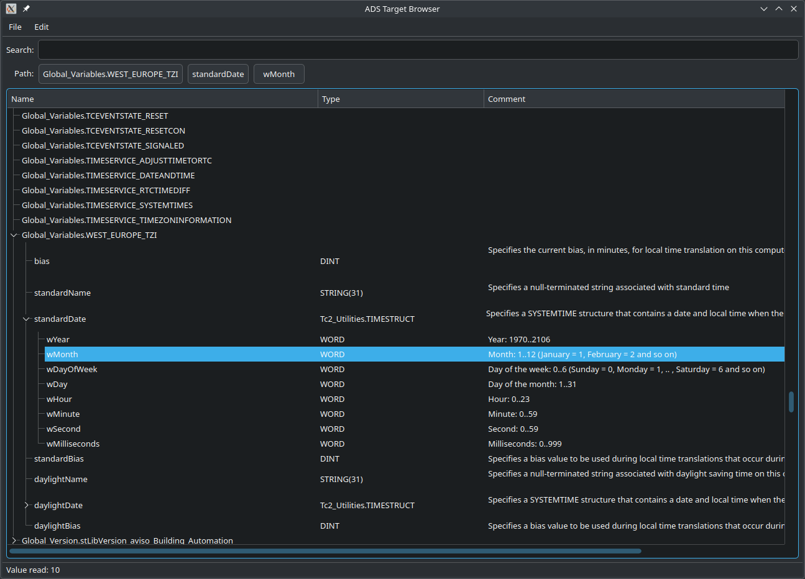

# Cross-platform (Qt) ADS Target Browser

This is a PLC target-browser for Beckhoff TwinCat ADS systems based on the insights from [ads-sample-16-qt-linux](https://github.com/tvogel/ads-sample-16-qt-linux).

## Features
- 🔗 Connect to remote PLC
- 🕑 Open recent connections
- 💾 local cache of symbol and data-type information
- 🔍 Search for symbols and attributes recursively
- 📋 Copy current attribute path to clipboard
- 📖 Read current attribute value from PLC
- 📤 Dump full symbol and data-type table to JSON files
- 🎁 Special treat: Create remote routes (following the example from [pyads](https://github.com/stlehmann/pyads/blob/1dd518b0cb0a64862ffe1a94aaad13247bbcbba6/pyads/pyads_ex.py#L285))

## Building

Install [Beckhoff/ADS](https://github.com/Beckhoff/ADS).

Copy this repository next to the `example` directory and follow the build instructions in their [`README.md`](https://github.com/Beckhoff/ADS/blob/master/README.md).

You'll need Qt 6 (developed with 6.8.2) including the `Core5Compat` module (for decoding Windows-1252 character sets)

